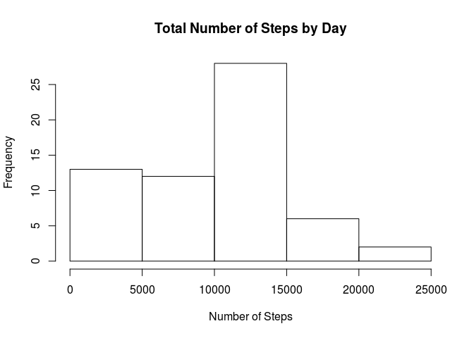
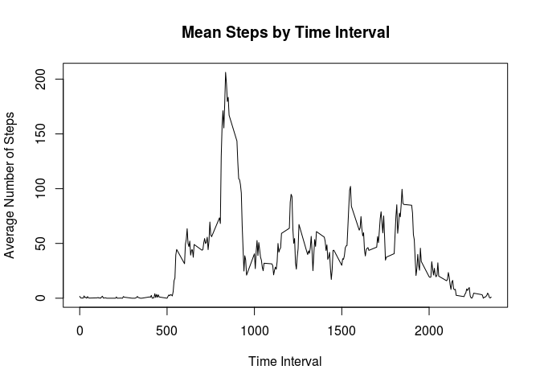

# Reproducible Research: Peer Assessment 1


## Loading and preprocessing the data


```r
# Show any code that is needed to
# Load the data (i.e. read.csv())
# Process/transform the data (if necessary) into a format suitable for your analysis

unzip("activity.zip")
activity <- read.csv("activity.csv", stringsAsFactors = FALSE)
activity$date <- as.Date(activity$date)
```

## What is mean total number of steps taken per day?


```r
# For this part of the assignment, you can ignore the missing values in the dataset.
# Make a histogram of the total number of steps taken each day

suppressPackageStartupMessages(library(data.table))
activity <- as.data.table(activity)

activity_sum <- activity[, list(steps = sum(steps, na.rm = TRUE)), by = date]
hist(activity_sum[["steps"]], 
     main = "Total Number of Steps by Day", 
     xlab = "Number of Steps")
```

 

```r
# Calculate and report the mean and median total number of steps taken per day
activity_mean_med <- activity_sum[, list(avg = mean(steps, na.rm = TRUE),
                                         med = median(steps, na.rm = TRUE))]
```

The mean number of steps taken per day is ***9354*** and the median number of steps taken per day is ***10395***.

## What is the average daily activity pattern?


```r
# Make a time series plot (i.e. type = "l") of the 5-minute interval (x-axis) and 
# the average number of steps taken, averaged across all days (y-axis)
# Which 5-minute interval, on average across all the days in the dataset, 
# contains the maximum number of steps?

int_mean <- activity[, list(avg = mean(steps, na.rm = TRUE)), by = interval]
plot(int_mean, type = "l", main = "Mean Steps by Time Interval", 
     xlab = "Time Interval", ylab = "Average Number of Steps")
```

 

```r
max_int <- int_mean[avg == max(avg)]
```

The 5-minute interval which, contains the maximum number of steps on average across all the days in the dataset is ***835***, at which time the average steps taken are ***206***.

## Imputing missing values


```r
# Note that there are a number of days/intervals where there are missing values (coded as NA). 
# The presence of missing days may introduce bias into some calculations or summaries of the data.
# Calculate and report the total number of missing values in the dataset 
# (i.e. the total number of rows with NAs)

missing_cases <- sum(!complete.cases(activity))

# Devise a strategy for filling in all of the missing values in the dataset. 
# The strategy does not need to be sophisticated. 
# For example, you could use the mean/median for that day, 
# or the mean for that 5-minute interval, etc.
# Create a new dataset that is equal to the original dataset 
# but with the missing data filled in.

suppressPackageStartupMessages(library(zoo)) ## <<- for na.aggregate

activity_impute <- copy(activity)
activity_impute[, steps := as.numeric(steps)][
  , steps := na.aggregate(steps), by = interval]

# Make a histogram of the total number of steps taken each day and 

activity_impute_sum <- activity_impute[, list(steps = sum(steps)), by = date]
hist(activity_impute_sum[["steps"]], 
     main = "Total Number of Steps by Day (Imputed Data)", 
     xlab = "Number of Steps")
```

 

```r
# Calculate and report the mean and median total number of steps taken per day. 
# Do these values differ from the estimates from the first part of the assignment? 
# What is the impact of imputing missing data on the estimates of the total daily number of steps?

activity_impute_mean_med <- activity_impute_sum[, list(avg = mean(steps), med = median(steps))]

diff_mean_med <- activity_impute_mean_med - activity_mean_med
```

The "activity" dataset includes 2304 incomplete rows. The "zoo" package was used to impute the missing data using the `na.aggregate` function. After imputing the data using the mean by interval, the mean number of steps taken per day is ***10766*** and the median number of steps taken per day is ***10766***.

The difference between the mean and median for imputed values as opposed to the original dataset is as follows:

* Mean: 1411
* Median: 371

Thus, imputing clearly makes a big difference in the results.

## Are there differences in activity patterns between weekdays and weekends?


```r
# For this part the weekdays() function may be of some help here. Use the dataset with the filled-in missing values for this part.
# Create a new factor variable in the dataset with two levels -- 
# "weekday" and "weekend" indicating whether a given date is a weekday or weekend day.

activity_impute[, weekday := ifelse(weekdays(date) %in% c("Saturday", "Sunday"), 
                                    "weekend", "weekday")]

# Make a panel plot containing a time series plot (i.e. type = "l") of the 5-minute interval (x-axis) 
# and the average number of steps taken, averaged across all weekday days or weekend days (y-axis).

activity_impute_interval <- activity_impute[, list(steps = mean(steps)), 
                                            by = list(weekday, interval)]
library(lattice)
xyplot(steps ~ interval | weekday, activity_impute_interval, type = "l", 
       layout = c(1, 2), xlab = "Interval", ylab = "Number of Steps")
```

 

